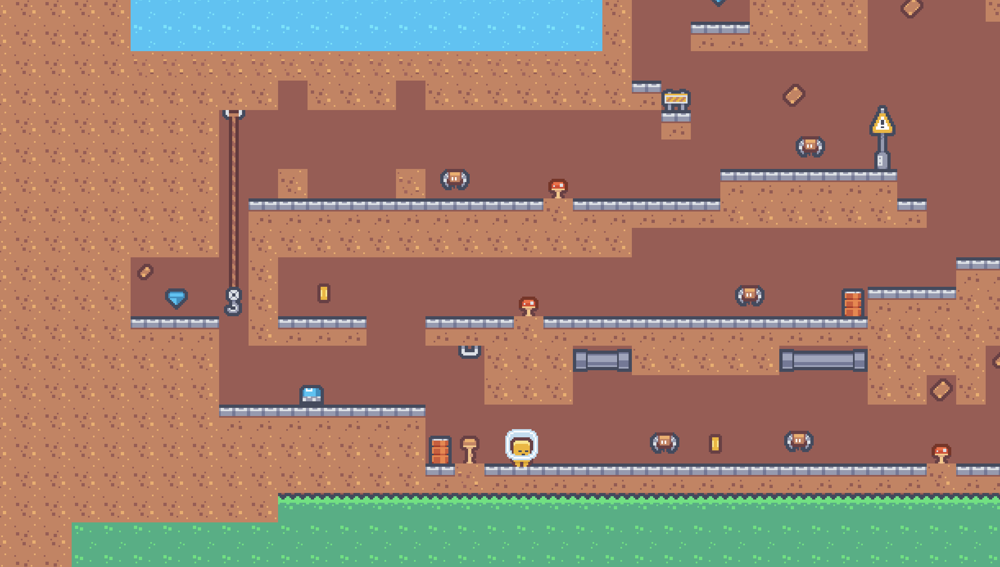

Today was all about level design. I cleared out the messy test setups and finally put together the first proper level. That means the game now has a structure instead of just isolated mechanics.

## **What I built today**

- **Level Design**- Cleaned up all placeholder/test setups.
- Designed the first playable level.

## **Notes**

I’ll be honest, I feel stuck on what makes a good level. The perfectionist in me keeps whispering to add more: more enemies, a guidance mechanic, falling rocks… It’s easy to lose track of the fact that this is a *jam*.

I also ran into some friction with art: the background tiles are clashing with the foreground tiles, so I’ve left it with a placeholder background for now.

## **What’s next?**

- **Playtesting** the first level.
- **Export & upload** a playable build.

If there’s time left:

- Add some lightweight **player guidance** (a sign, text prompt, or simple UI).
- Give the bats movement.
- Maybe experiment with falling rocks for extra tension.

## **Reflections**

The core loop is there, the first level is there, and the exit condition is there. That’s an MVP. Everything else is polish or “nice to have.” My job now is to stop chasing perfection and make sure players can *play and finish* the game.

Catch you in the next log.
